# Swingy

A Java RPG built for 42 school. Play through a text-based console or a Swing GUI — same game logic, two different views.

## Build & Run

```bash
mvn clean package
java -jar target/swingy.jar console
java -jar target/swingy.jar gui
```

Requires Java 17+.

---

## Architecture

The project follows the **MVC pattern**. The controller drives the game loop and delegates all input/output through a `GameView` interface, which both `ConsoleView` and `GUIView` implement. Hero persistence uses the **Repository pattern** — `HeroRepository` is an interface; `FileHeroRepository` is the concrete implementation. The view receives data exclusively through **DTO records** (`HeroStats`, `MapState`, `ArtifactStats`) — no model objects are ever exposed to the view.

```
Main
 ├── FileHeroRepository  implements  HeroRepository
 ├── ConsoleView         implements  GameView
 │   or GUIView          implements  GameView
 └── Controller
      ├── GameView        (reference to the view above)
      ├── HeroRepository  (reference to the repository above)
      ├── Hero
      ├── GameMap
      └── Villain
```

`Battle` is a utility class called statically from inside `Controller` — it has no state of its own.

### Package layout

```
com.swingy/
├── Main.java
├── controller/
│   └── Controller.java          — game loop, battle logic, hero setup
├── model/
│   ├── hero/
│   │   ├── Hero.java            — stats, level-up, artifact slots
│   │   ├── HeroBuilder.java     — Builder pattern for hero construction
│   │   └── HeroType.java        — WARRIOR, WIZARD, ROGUE
│   ├── villain/
│   │   └── Villain.java
│   ├── artifact/
│   │   ├── Artifact.java        — base class with value field
│   │   ├── Weapon.java
│   │   ├── Armor.java
│   │   └── Helm.java
│   ├── battle/
│   │   ├── Battle.java          — utility class, static methods only
│   │   └── BattleResult.java
│   ├── map/
│   │   └── GameMap.java         — grid, hero/villain positions
│   ├── DirectionType.java
│   └── GameResult.java
├── view/
│   ├── GameView.java            — interface shared by both views
│   ├── HeroStats.java           — DTO record
│   ├── MapState.java            — DTO record
│   ├── ArtifactStats.java       — DTO record
│   ├── console/
│   │   └── ConsoleView.java
│   └── gui/
│       ├── GUIView.java
│       ├── UIFactory.java       — Factory pattern for styled components
│       ├── IconLoader.java      — icon cache, preloading
│       ├── ColorPalette.java    — color tokens
│       └── Typography.java      — text style tokens
└── repository/
    ├── HeroRepository.java      — interface
    └── FileHeroRepository.java  — text-file persistence (mandatory)
```

---

## Design System

The GUI uses a small design system centralised in three files. All visual decisions go through these — no raw colours or font sizes scattered across view code.

### Color palette

| Token        | Hex       | Used for                           |
| ------------ | --------- | ---------------------------------- |
| `BLACK`      | `#111111` | Screen background                  |
| `DARK_GRAY`  | `#151515` | Map grid, text fields, selectors   |
| `LIGHT_GRAY` | `#EBEBEB` | All text labels                    |
| `WHITE`      | `#FFFFFF` | Cell borders                       |
| `ACCENT`     | `#20639B` | Primary buttons, highlighted stats |

### Typography scale

| Style         | Size | Weight | Color      |
| ------------- | ---- | ------ | ---------- |
| `TITLE`       | 28px | Bold   | LIGHT_GRAY |
| `H1`          | 24px | Bold   | LIGHT_GRAY |
| `H2`          | 18px | Bold   | LIGHT_GRAY |
| `STAT`        | 12px | Plain  | LIGHT_GRAY |
| `STAT_ACCENT` | 12px | Bold   | ACCENT     |

### UIFactory

`UIFactory` is the single entry point to create styled components following the **Factory pattern**. Nothing in `GUIView` creates raw Swing components directly — it always goes through the factory. Supported styles: `PRIMARY`, `SECONDARY`, `FIELD`, `SELECTOR`.

---

## Gameplay Rules

- **Map size:** `(level - 1) * 5 + 10 - (level % 2)`
- **Hero starts** at the center; **wins** by reaching any border cell
- **XP to next level:** `level * 1000 + (level - 1)^2 * 450`
- **Encounter:** fight or run (50% escape chance)
- **Artifacts:** Weapon (+attack), Armor (+defense), Helm (+hit points) — value scales with villain strength; hero decides to keep or leave after winning

---

## Sprites

All icons are vector art displayed at 56 × 56 px.

### Heroes

| Warrior | Rogue | Wizard |
|:---:|:---:|:---:|
| 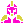 | 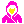 | 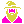 |

### Villains

| Dragon | Dracula | Skeleton |
|:---:|:---:|:---:|
| 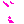 | 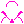 | 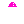 |

### Artifacts

| Weapon | Armor | Helm |
|:---:|:---:|:---:|
| 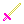 | 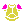 | 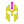 |

### Battle

| Fight | Fight 2 | Lose |
|:---:|:---:|:---:|
| 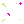 | 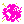 |  |
