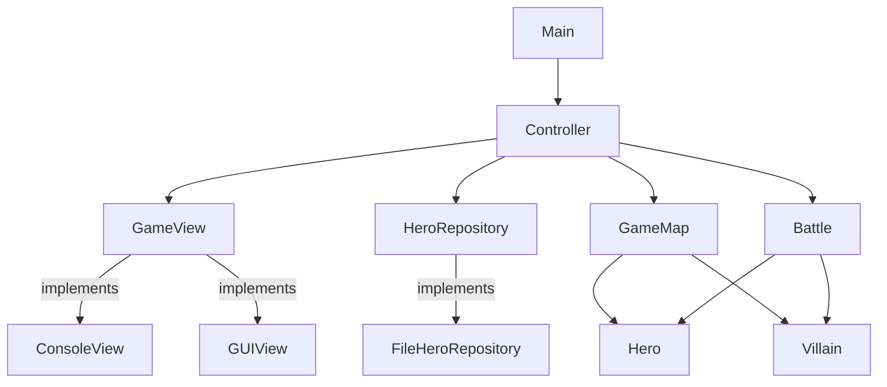
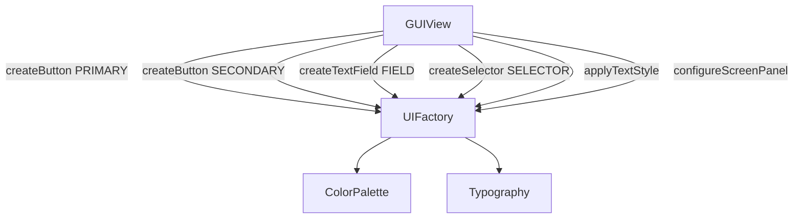
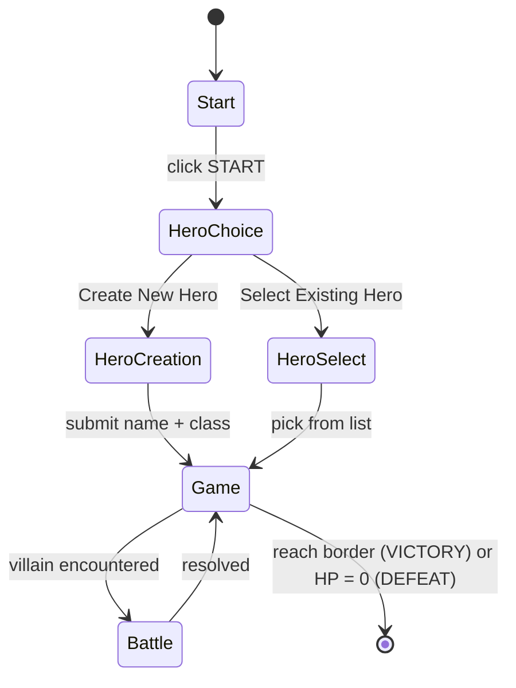
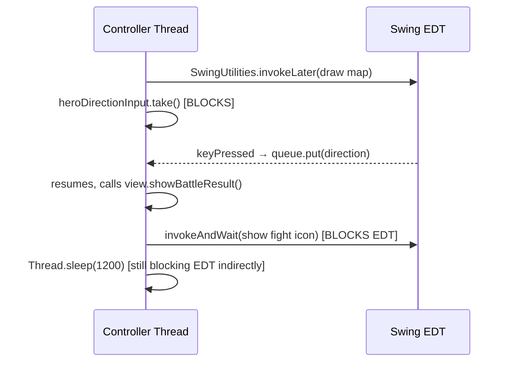
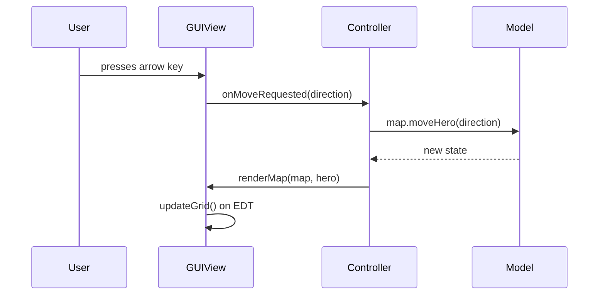

# Swingy

A Java RPG built for 42 school. Play through a text-based console or a Swing GUI — same game logic, two different views.

## Build & Run

```bash
mvn clean package
java -jar target/swingy.jar console
java -jar target/swingy.jar gui
```

Requires Java 17+.

---

## Architecture

The project follows the **MVC pattern**. The controller drives the game loop and delegates all input/output through a `GameView` interface, which both `ConsoleView` and `GUIView` implement.



### Package layout

```
com.swingy/
├── Main.java
├── controller/
│   └── Controller.java          # game loop, battle logic, hero setup
├── model/
│   ├── hero/
│   │   ├── Hero.java            # stats, level-up, artifact slot
│   │   ├── HeroBuilder.java
│   │   └── HeroType.java        # WARRIOR, WIZARD, ROGUE
│   ├── villain/
│   │   └── Villain.java
│   ├── artifact/
│   │   ├── Artifact.java        # base class with value field
│   │   ├── Weapon.java
│   │   ├── Armor.java
│   │   └── Helm.java
│   ├── battle/
│   │   ├── Battle.java
│   │   └── BattleResult.java
│   ├── map/
│   │   └── GameMap.java         # grid, hero/villain positions
│   ├── DirectionType.java
│   └── GameResult.java
├── view/
│   ├── GameView.java            # interface shared by both views
│   ├── HeroCreationData.java    # record DTO
│   ├── console/
│   │   └── ConsoleView.java
│   └── gui/
│       ├── GUIView.java
│       ├── UIFactory.java       # component factory
│       ├── ColorPalette.java    # color tokens
│       ├── Typography.java      # text style tokens
│       └── Helpers.java
└── repository/
    ├── HeroRepository.java      # interface
    └── FileHeroRepository.java  # text-file persistence (mandatory)
```

---

## Design System

The GUI uses a small design system centralised in three files. All visual decisions go through these — no raw colours or font sizes scattered across view code.

### Color palette

| Token | Hex | Used for |
|---|---|---|
| `BLACK` | `#111111` | Screen background |
| `DARK_GRAY` | `#151515` | Map grid, text fields, selectors |
| `LIGHT_GRAY` | `#EBEBEB` | All text labels |
| `WHITE` | `#FFFFFF` | Cell borders |

### Typography scale

| Style | Size | Weight | Color |
|---|---|---|---|
| `TITLE` | 28px | Bold | LIGHT_GRAY |
| `H1` | 24px | Bold | LIGHT_GRAY |
| `H2` | 18px | Bold | LIGHT_GRAY |
| `BODY` | 16px | Plain | LIGHT_GRAY |

### UIFactory

`UIFactory` is the single entry point to create styled components. Nothing in `GUIView` calls `new JButton()` directly — it always goes through the factory.



---

## Screens & Navigation

The GUI uses a `CardLayout` to switch between screens. The controller drives which card is shown via `GameView` method calls.



---

## Gameplay Rules

- **Map size:** `(level - 1) * 5 + 10 - (level % 2)`
- **Hero starts** at the center; **wins** by reaching any border cell
- **XP to next level:** `level * 1000 + (level - 1)^2 * 450`
- **Encounter:** fight or run (50 % escape chance)
- **Artifacts:** Weapon (+attack), Armor (+defense), Helm (+hit points) — value scales with villain strength; hero decides to keep or leave after winning

---

## Current Status

### What works
- Console mode: full game loop (hero creation, movement, battles, artifact pickup, persistence)
- GUI mode: hero creation, map rendering with hero + villain icons, arrow-key movement, battle animation (fight icon -> result icon), hero stats bar

### Known limitations / in progress

| Area | Status |
|---|---|
| `askSelectHero` in GUI | not implemented yet (returns null) |
| `showMessage` in GUI | no-op |
| `showHeroDetails` post-setup | reuses heroName card (placeholder) |
| Artifact pickup dialog | `JOptionPane` (modal, works but out of style) |
| Fight dialog | `JOptionPane` (same) |
| Hero persistence save on end | heroes list may be null if no load was done |

### Architecture concern: GUI event model

The current GUI bridges Swing's event-driven model back to the controller's **synchronous loop** using `BlockingQueue` and `CountDownLatch`. The controller thread blocks on `queue.take()` waiting for user input; a button/key listener puts to the queue from the EDT.

This works for simple flows but breaks down when extending the design system — adding new screens, conditional transitions, or non-linear flows forces awkward latching logic and risks EDT deadlocks (e.g. calling `invokeAndWait` from code that is already on the EDT, or nested blocking calls).



**Planned refactor: event-driven MVC for GUI**

The fix is to invert control for the GUI path — the controller should not own the loop when running in GUI mode. Instead:

- `GUIView` fires events (or calls controller callbacks) when the user acts
- The controller reacts, updates the model, and tells the view what to render next
- No `BlockingQueue`, no `CountDownLatch`, no `invokeAndWait` in the view



This makes adding screens, dialogs, and transitions straightforward without touching synchronization primitives.
